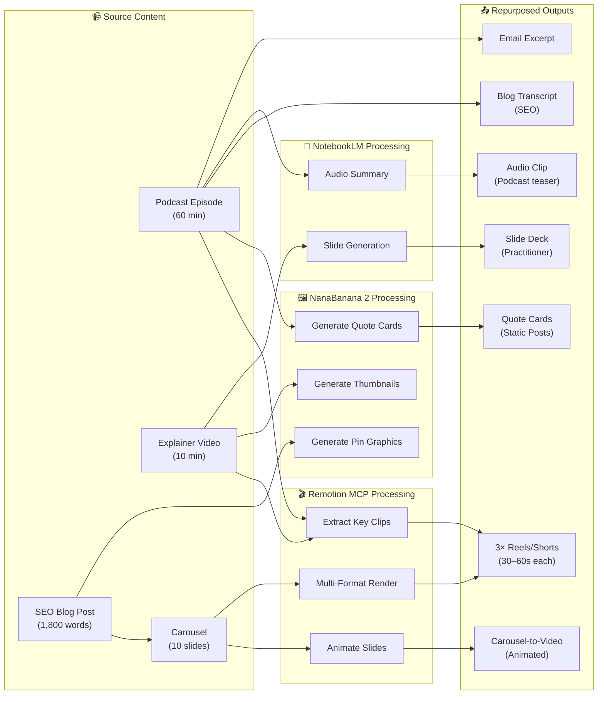
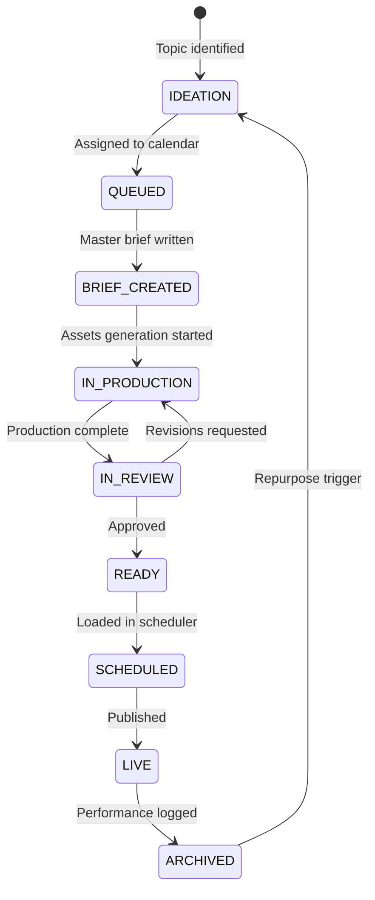
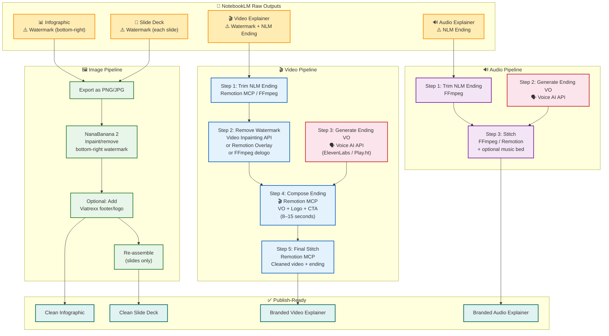
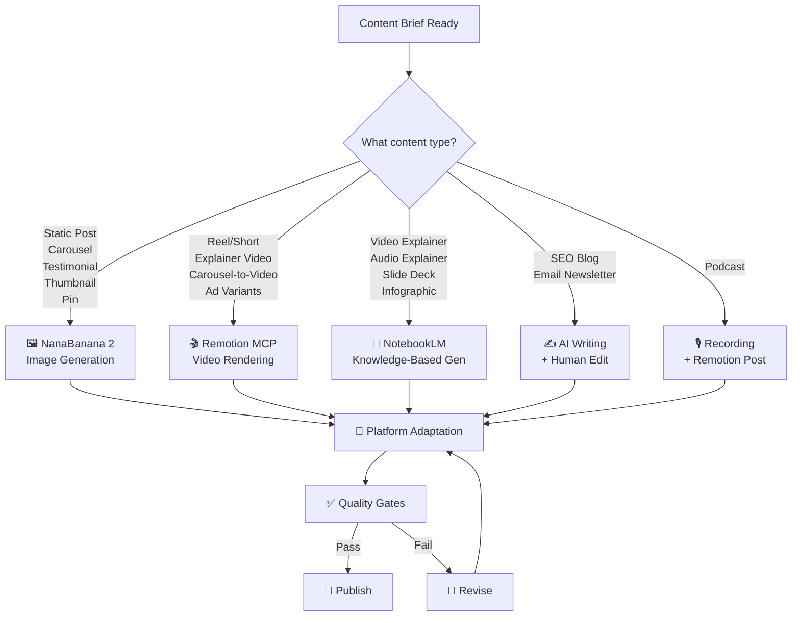

# Viatrexx Content Creation System — Flow Diagram

**Version:** Phase 2 (March 2026)

---

## System Architecture Diagram

```mermaid
graph TB
    subgraph DATABASES["📊 DATABASES"]
        direction TB
        DB_PILLARS["🏛️ Pillars DB<br/>7 Core Pillars<br/>P1–P7"]
        DB_TOPICS["📋 Topics DB<br/>140 Topics<br/>Mapped to Pillars"]
        DB_TYPES["🎬 Content Types DB<br/>12 Content Types<br/>CT01–CT12"]
        DB_PLATFORMS["📱 Platforms DB<br/>7 Platforms<br/>PL01–PL07"]
        DB_CATEGORIES["🏷️ Categories DB<br/>Audience, Condition,<br/>Purpose, Product, SEO"]
        DB_SCHEDULE["📅 Schedule DB<br/>Weekly Calendar<br/>Q1 2026 – Q1 2027"]
        DB_QUEUE["📬 Queue DB<br/>Content Pipeline<br/>Status Tracking"]
    end

    subgraph PLANNING["📝 PLANNING LAYER"]
        WEEKLY["🗓️ Weekly Topic Selection<br/>Pillar + Topic + Week"]
        ASSIGN["📌 Content Assignment<br/>Types × Platforms × Awareness"]
    end

    subgraph BRIEFING["📄 BRIEFING LAYER"]
        BRIEF["✍️ Master Content Brief<br/>One per Topic × Type"]
        BRIEF_STATIC["Brief: Static Post"]
        BRIEF_CAROUSEL["Brief: Carousel"]
        BRIEF_REEL["Brief: Reel/Short"]
        BRIEF_VIDEO["Brief: Explainer Video"]
        BRIEF_PODCAST["Brief: Podcast"]
        BRIEF_BLOG["Brief: SEO Blog"]
        BRIEF_EMAIL["Brief: Email"]
        BRIEF_NLM["Brief: NotebookLM<br/>(Video/Audio/Slides/Infographic)"]
        BRIEF_TESTIMONIAL["Brief: Testimonial"]
    end

    subgraph PRODUCTION["🏭 PRODUCTION LAYER (AI Tools)"]
        direction TB
        NANA["🖼️ NanaBanana 2<br/>━━━━━━━━━━━<br/>• Static images<br/>• Carousel slides<br/>• Thumbnails<br/>• Quote cards<br/>• Pinterest pins<br/>• NLM watermark removal"]
        NLM["🧠 NotebookLM<br/>━━━━━━━━━━━<br/>• Video explainers<br/>• Audio explainers<br/>• Slide decks<br/>• Infographics<br/>• Blog drafts<br/>⚠️ Raw output only"]
        REMOTION["🎬 Remotion MCP<br/>━━━━━━━━━━━<br/>• Reels/Shorts (9:16)<br/>• Explainer videos (16:9)<br/>• Carousel → video<br/>• Animated overlays<br/>• A/B hook variants<br/>• Batch rendering"]
    end

    subgraph POSTPROC["🔧 NLM POST-PROCESSING LAYER"]
        direction TB
        PP_IMG["🖼️ Image Cleanup<br/>NanaBanana 2<br/>━━━━━━━━━━━<br/>Remove watermark<br/>(Infographics & Slides)<br/>Add Viatrexx branding"]
        PP_VID["🎬 Video Cleanup<br/>Remotion MCP + Video API<br/>━━━━━━━━━━━<br/>1. Trim NLM ending<br/>2. Remove video watermark<br/>3. Add branded ending<br/>(Voice AI + Remotion)"]
        PP_AUD["🔊 Audio Cleanup<br/>FFmpeg + Voice AI<br/>━━━━━━━━━━━<br/>1. Trim NLM ending<br/>2. Add branded ending<br/>(Voice AI VO + music)"]
        VOICE["🗣️ Voice AI API<br/>━━━━━━━━━━━<br/>ElevenLabs / Play.ht<br/>Branded ending VO<br/>Match NLM narrator tone"]
    end

    subgraph ADAPTATION["🔄 PLATFORM ADAPTATION"]
        direction TB
        FB["📘 Facebook<br/>1080×1080 / 1080×1920"]
        IG["📸 Instagram<br/>1080×1350 / 1080×1920"]
        LI["💼 LinkedIn<br/>1080×1080 / PDF"]
        PIN["📌 Pinterest<br/>1000×1500"]
        YT["▶️ YouTube<br/>1920×1080 / 1080×1920"]
        WEB["🌐 Website<br/>SEO Blog / Embeds"]
        EMAIL["📧 Email<br/>Segmented Sends"]
    end

    subgraph PUBLISHING["🚀 PUBLISH & TRACK"]
        REVIEW["✅ Quality Gates<br/>Science | Brand | Legal | Visual | SEO"]
        SCHEDULE_PUB["📅 Schedule & Publish"]
        TRACK["📊 Performance Tracking<br/>Impressions | Engagement | Saves | Clicks"]
        REPURPOSE["♻️ Repurpose Pipeline"]
    end

    %% Flow connections
    DB_PILLARS --> WEEKLY
    DB_TOPICS --> WEEKLY
    DB_SCHEDULE --> WEEKLY
    WEEKLY --> ASSIGN
    DB_TYPES --> ASSIGN
    DB_PLATFORMS --> ASSIGN
    DB_CATEGORIES --> ASSIGN

    ASSIGN --> BRIEF
    BRIEF --> BRIEF_STATIC
    BRIEF --> BRIEF_CAROUSEL
    BRIEF --> BRIEF_REEL
    BRIEF --> BRIEF_VIDEO
    BRIEF --> BRIEF_PODCAST
    BRIEF --> BRIEF_BLOG
    BRIEF --> BRIEF_EMAIL
    BRIEF --> BRIEF_NLM
    BRIEF --> BRIEF_TESTIMONIAL

    BRIEF_STATIC --> NANA
    BRIEF_CAROUSEL --> NANA
    BRIEF_TESTIMONIAL --> NANA
    BRIEF_REEL --> REMOTION
    BRIEF_VIDEO --> REMOTION
    BRIEF_NLM --> NLM
    BRIEF_PODCAST --> REMOTION
    BRIEF_CAROUSEL --> REMOTION

    %% NLM Post-Processing flow
    NLM -->|"Infographics & Slides"| PP_IMG
    NLM -->|"Video Explainers"| PP_VID
    NLM -->|"Audio Explainers"| PP_AUD
    VOICE --> PP_VID
    VOICE --> PP_AUD

    %% Clean outputs to platform adaptation
    NANA --> FB
    NANA --> IG
    NANA --> LI
    NANA --> PIN
    PP_IMG --> FB
    PP_IMG --> IG
    PP_IMG --> LI
    PP_IMG --> PIN
    PP_VID --> YT
    PP_VID --> WEB
    PP_VID --> LI
    PP_AUD --> WEB
    REMOTION --> IG
    REMOTION --> YT
    REMOTION --> FB

    BRIEF_BLOG --> WEB
    BRIEF_EMAIL --> EMAIL

    FB --> REVIEW
    IG --> REVIEW
    LI --> REVIEW
    PIN --> REVIEW
    YT --> REVIEW
    WEB --> REVIEW
    EMAIL --> REVIEW

    REVIEW --> SCHEDULE_PUB
    SCHEDULE_PUB --> TRACK
    TRACK --> REPURPOSE
    REPURPOSE --> DB_QUEUE

    DB_QUEUE --> ASSIGN

    %% Styling
    classDef database fill:#E8F4FD,stroke:#2196F3,stroke-width:2px
    classDef planning fill:#FFF3E0,stroke:#FF9800,stroke-width:2px
    classDef briefing fill:#F3E5F5,stroke:#9C27B0,stroke-width:2px
    classDef production fill:#E8F5E9,stroke:#4CAF50,stroke-width:2px
    classDef postproc fill:#FFF9C4,stroke:#F9A825,stroke-width:2px
    classDef platform fill:#FBE9E7,stroke:#FF5722,stroke-width:2px
    classDef publish fill:#E0F2F1,stroke:#009688,stroke-width:2px

    class DB_PILLARS,DB_TOPICS,DB_TYPES,DB_PLATFORMS,DB_CATEGORIES,DB_SCHEDULE,DB_QUEUE database
    class WEEKLY,ASSIGN planning
    class BRIEF,BRIEF_STATIC,BRIEF_CAROUSEL,BRIEF_REEL,BRIEF_VIDEO,BRIEF_PODCAST,BRIEF_BLOG,BRIEF_EMAIL,BRIEF_NLM,BRIEF_TESTIMONIAL briefing
    class NANA,NLM,REMOTION production
    class PP_IMG,PP_VID,PP_AUD,VOICE postproc
    class FB,IG,LI,PIN,YT,WEB,EMAIL platform
    class REVIEW,SCHEDULE_PUB,TRACK,REPURPOSE publish
```

---

## Repurposing Flow Diagram

---

## Content Queue State Machine

---

## NotebookLM Post-Processing Pipeline Diagram

---

## AI Tool Decision Tree

